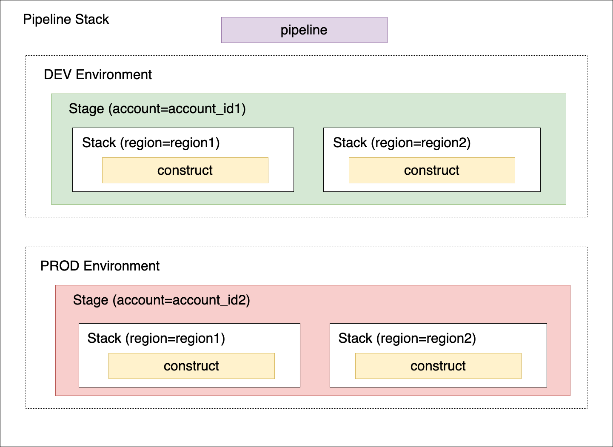

# Example multi-account multi-region AWS CDK pipeline

## Composition



## Configuration

The configuration for an environment is created by merging the following configs in the following order

- `<deployment_id>/common.yaml`
- `<deployment_id>/common.local.yaml`
- `<deployment_id>/<environment_id>.yaml`
- `<deployment_id>/<environment_id>.local.yaml`

All configs ending in `.local.yaml` are ignored by git. They allow developers to override settings locally within their development environment.

## Manual steps

### Github access token

Generate a [github access token](https://docs.github.com/en/authentication/keeping-your-account-and-data-secure/managing-your-personal-access-tokens) with scopes `repo` and `admin:repo_hook`. Store the secret in Secrets Manager in the region selected for the CI/CD pipeline (see common config) under the configurable key defined in the config.

### Bootstrap AWS regions for CDK

Bootstrapping of AWS accounts is described [here](https://docs.aws.amazon.com/cdk/v2/guide/cdk_pipeline.html#cdk_pipeline_bootstrap).

In the account/region where the pipeline is deployed, run

```
cdk bootstrap aws://<account number>/<region> --profile <aws profile name> --cloudformation-execution-policies arn:aws:iam::aws:policy/AdministratorAccess
```

In all account/region pairs where resources are deployed by the pipeline, run

```
cdk bootstrap aws://<account number>/<region> --profile <aws profile name> --cloudformation-execution-policies arn:aws:iam::aws:policy/AdministratorAccess --trust <pipeline account number>
```

### Deploy pipeline

Do initial deployment of the CI/CD pipeline

```
cdk deploy '*-pipeline'
```

After the initial deployment, the pipeline is self-mutating. You only need to merge your code to the branch used by the pipeline (see config for the exact value, usually `main` branch).

## Development environment

### Virtual environment


To manually create a virtualenv on MacOS and Linux:

```
$ python3 -m venv .venv
```

After the init process completes and the virtualenv is created, you can use the following
step to activate your virtualenv.

```
$ source .venv/bin/activate
```

If you are a Windows platform, you would activate the virtualenv like this:

```
% .venv\Scripts\activate.bat
```

Once the virtualenv is activated, you can install the required dependencies.

```
$ pip install -r requirements/requirements-dev.txt
```

### Pre-commit hooks

Install the hooks locally

```
pre-commit install
```

The pre-commit hooks will run every time you commit your code. Some of the hooks fix the issues identified. Therefore, if they fail, try to stage the new changes and commit again. If things continue to fail, then you need to manually fix the error reported.

There might be reason for committing your work without running the hooks. For example, you might want to push to a branch some work in progress. You can skip the checks with the `--no-verify` flag

```
git commit -m "<your message here>" --no-verify
```

The hooks run only on files that have changed. To run the hooks on all files without attempting to create a commit, run

```
make pre-commit
```

### CDK project

Once you have activated the virtual environment and installed the dependencies, you can synthesize the CloudFormation template for this code.

```
$ cdk synth
```


Useful commands

 * `cdk ls`          list all stacks in the app
 * `cdk synth`       emits the synthesized CloudFormation template
 * `cdk deploy`      deploy this stack to your default AWS account/region
 * `cdk diff`        compare deployed stack with current state
 * `cdk docs`        open CDK documentation
